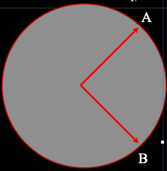

# GPS Based Autopilot System

Here in this project we develped an ***Autopilot system*** based on GPS and magnetometre (electronic compass ). The system can be mounted on a UAV Drone or a boat or even a submarine or a car (RC toys). The autopilot system successfully tested with an RC car and customised robot.

* ***RC Car with Autopilot System***

* ***Custom bot with Autopilot***

  

## Autopilot bot working

There is a front-end software running in host computer, using that we can control the autopilot bot via bluetooth. Initially the operator can draw the path needs to travel in the Google Earth interface. The google earth converts it into KML file and the python parser program takes the KML file and convert this to waypoints consist of latitude, longitude pairs. And the python inteface send this waypoints to the autopilot bot.

This autopilot bot determines it's current location using GPS. Magnetometer is used to get the current heading. And move to next waypoint location by finding the bearing angle and distance usig ***Haversine algorithm***. It capture some of the sensor data at each waypoint and store it in the local database. Once the bot comes back to the communication range of host machine, it sends all the collected data to the host. And host machine visualise this data on google earth.

*Here the map displaying the distance to nearest obstacle from wach waypoint.*

## Block Diagram

## Circuit Diagram

### Componets used

* MCU : Atmega328 x 2
* GPS Receiver : NEO-6M 
* Magnetometer : HMC5883L
* Lidar : RP-Lidar A1M8
* Bluetooth Module : HC-06
* Motor Driver : L293D
* Gear moter x 2 : 300 RPM
* Servo motor : 180 degree.

## PCB Design

## Flow Chart

## Haversine Formula

The haversine formula determines the great-circle distance between two points on a sphere given their longitudes and latitudes.

-  Bearing from point A to B, can be calculated as,

  ​    **β = atan2(X,Y)**

  ​    where, **X** and **Y** are two quantities and can be calculated as:

  ​    **X = cos θb \* sin ∆L**

  ​    **Y = cos θa \* sin θb – sin θa \* cos θb \* cos ∆L**

  ​    **The angle object should move = heading – bearing** 

- One can derive Haversine formula to calculate distance between two as:

     **a = sin²(Δ θ/2) + cos(θa ).cos( θb ).sin²(ΔL/2)
     c = 2.atan2(√a, √(1−a))
     d = R.c** 

   where,

   	**Δ θ** = lat1 – lat2 (difference of latitude)

   	**ΔL** = lon1 – lon2 (difference of longitude)

  	 **R** is radius of earth i.e, **6371 KM or 3961 miles**

  	 and **d** is the distance computed between two points.
